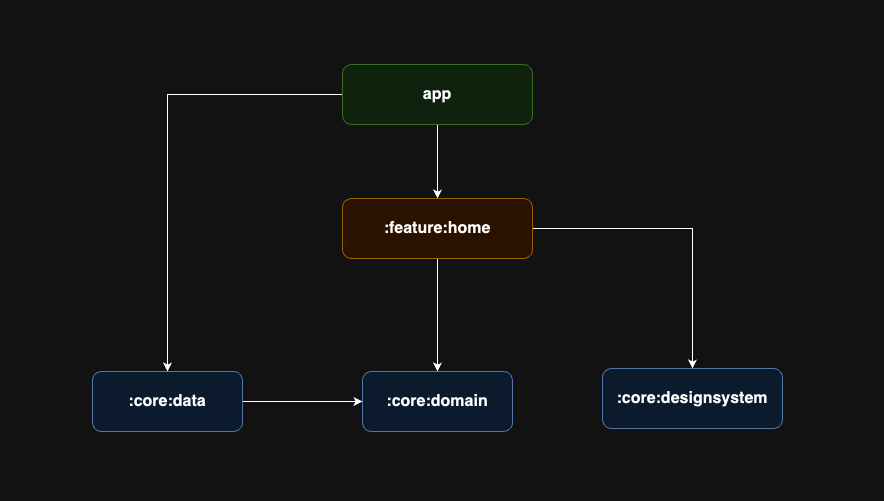

# MUSINSA - Android Mobile Engineer 사전과제
권대원

# 아키텍처

* [UDF(Unidirectional Data Flow)](https://developer.android.com/topic/architecture/ui-layer?hl=ko#udf) 패턴을 적용하여 데이터의 단방향 흐름을 유지하고 있습니다.
- 상위 레이어는 하위 레이어 데이터 상태 변경에 유연하게 대응할 수 있습니다.
- Event 흐름은 Ui -> ViewModel 로 흐르며, ViewModel 이 작업을 처리하고 상태를 업데이트 하거나, Data Layer 에게 요청하게 됩니다.
- Data Layer 에서 변경된 데이터는 ViewModel 을 통해 Ui Layer 에서 Observe 하여 화면을 갱신합니다.

프로젝트에는 다음 유형의 모듈이 포함되어 있습니다.

* `app` module - app level의 클래스를 갖고 있으며 `home` 모듈과 `core` 모듈 의존성을 갖고 있습니다.

* `home` module - `core` 모듈에 대해 의존성을 가지며 해당 UI 화면을 담당합니다.

* `core` modules - 앱의 다른 모듈 간에 공유해야 하는 컴포넌트 및 특정 종속성을 포함하는 공통 라이브러리 모듈입니다.

# Modules

* `app` - navigation 과 UI Scaffolding 을 담당합니다. ex) MainActivity, Compose Navigation
* `feature` - 특정 기능, 유저와 마주하는 모듈입니다. UI 컴포넌트와 ViewModel을 포함하고 있습니다.
    * `feature:home` - 서버로부터 데이터를 받아 사용자에게 홈 화면을 보여줍니다.
* `core:domain` - 비즈니스 로직에 사용되는 model 또는 repository 를 갖습니다.
* `core:data` - 네트워크 요청과 응답을 처리합니다.
  - [Hilt, Retrofit](/core/data/src/androidTest/java/com/musinsa/mobile/data/DataSourceTest.kt) Hilt 의존성 주입과 Retrofit 통신 테스트를 진행했습니다.
* `core:designsystem` - 앱 내에서 공통으로 사용되는 UI 컴포넌트를 관리합니다.

* Optional
  * airbnb/mavericks 활용
  * 테스트 코드 작성
  * 배너 3초 간격 자동 스와이프
  * 배너 Parallax 스와이프

# 사용한 기술
Jetpack Compose, Mavericks(MVI), Coroutines, Flow, Hilt, Coil, okhttp3, Retrofit2, junit
